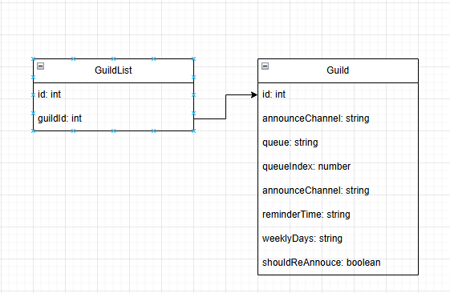

<!-- TABLE OF CONTENTS -->
<details>
  <summary>Table of Contents</summary>
  <ol>
    <li>
      <a href="#about-the-project">About The Project</a>
    </li>
    <li>
      <a href="#getting-started">Getting Started</a>
      <ul>
        <li><a href="#prerequisites">Prerequisites</a></li>
        <li><a href="#installation">Installation</a></li>
      </ul>
    </li>
    <li><a href="#usage">Usage</a></li>
    <li><a href="#🔧-steps-to-add-a-custom-adapter">Use your own database</a></li>
  </ol>
</details>

<!-- ABOUT THE PROJECT -->

## About The Project

**Discord Rotate Bot** is a simple yet effective Discord bot designed to manage circular queues for rotating tasks or responsibilities. It helps automate turn-taking in your community or team by maintaining a queue and cycling through it on demand or on a schedule.

A common use case is choosing who should host a daily meeting or stand-up — ensuring everyone gets a fair turn without manual tracking.

### Key Features

- 🔁 Circular queue rotation for users or items
- 📆 Daily or on-demand rotation announcements
- 🔔 Notifies the next person in line directly in your chosen channel

This bot is ideal for agile teams, gaming communities, or any group needing to fairly rotate tasks without hassle.

<!-- GETTING STARTED -->

## Getting Started

This is an example of how you may give instructions on setting up your project locally.
To get a local copy up and running follow these simple example steps.

### Prerequisites

Before you can run the Discord Rotate Bot, make sure you have the following installed:

- [Node.js](https://nodejs.org/) (v20 or higher)
- [yarn](https://yarnpkg.com/) for managing packages
- A [Discord account](https://discord.com/) and a server where you have permission to add bots
- A [Discord Bot Token](https://discord.com/developers/applications) from the Discord Developer Portal

### Installation

Follow these steps to install and run the Discord Rotate Bot locally:

1. **Copy the example environment file**

   Copy the provided example environment file and rename it to `.env`:

   ```sh
   cp example.env .env
   ```

   Then open .env and fill in your values:

2. **Install dependencies**

   Use Yarn to install all necessary packages:

   ```sh
   yarn
   ```

3. Start the bot in development mode
   Launch the bot using the development script:

   ```sh
   yarn dev
   ```

Your bot should now be running and ready to be invited to your server!

<!-- USAGE EXAMPLES -->

## Usage

After starting the bot and inviting it to your server, you can control it using the following commands. These commands help you manage the rotation queue, configure settings, and get help.

### 🎯 Rotation Commands

- `/skip`: Skips the current person and moves them to the end of the queue.

- `/list`: Displays the current queue of users in order.

- `/add`: Add one or more users to the queue.

- `/remove`: Remove a member from the queue.

- `/reset`: Reset the queue to the initial state

- `/start_over`: Restarts the rotation from the beginning of the current queue.

---

### ⚙️ Configuration Commands

- `/config_channel`: Sets the channel where rotation announcements will be posted.

- `/set_reminder_time HH:MM`: Sets a daily reminder time (in 24h format, Example: 14:00) to trigger the rotation automatically. Default to 11:00(AM) everyday

- `/set_weekly_time`: Sets specific weekday and time for weekly rotation.

- `/view_weekly_time`: Shows the currently configured weekly rotation schedule.

---

### 🔗 Utility Commands

- `/get_invite_link`: Generates a bot invite link you can use to add it to other servers.

- `/help`: Lists all available commands and their descriptions.

## 💾 Custom Storage Adapter

The Discord Rotate Bot is designed with flexibility in mind — you can plug in your own database or storage backend without modifying core logic. This is useful if you want to use a different database like MongoDB, PostgreSQL, Redis, or even a file-based store.

### 🔧 Steps to Add a Custom Adapter

1. **Create a new adapter class**

   Create a new file in `src/store/` (e.g., `MyCustomAdapter.ts`) and implement the `StateAdapter` interface.

   The interface is defined here: `/src/store/abstract/StateAdapter.ts`

   Your class must implement all required methods defined in the interface, such as saving/loading rotation state, managing queue members, and handling config values.

2. **Update the default adapter**

   Edit the export in `/config/db.ts` file

   Replace the existing adapter with your custom class:

   ```ts
   import MyCustomAdapter from "../src/store/MyCustomAdapter";
   export default MyCustomAdapter;
   ```

   Or you can view `/src/store/abstract/StateAdapter.ts` as an example

3. **Done!**

   The bot will now use your custom storage implementation for all queue operations, reminders, and configurations.

### 🗃️ Default Storage: SQLite

The bot uses [SQLite](https://www.sqlite.org/) as the default storage backend — a lightweight, file-based database that works out of the box with no setup required. All data is saved locally and persists between runs.

Here's a simplify version of current database schema



To use a different storage system, see [Custom Storage Adapter](#-custom-storage-adapter).
